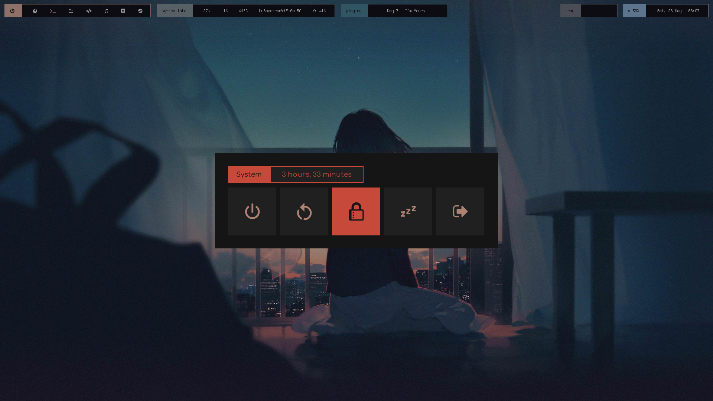
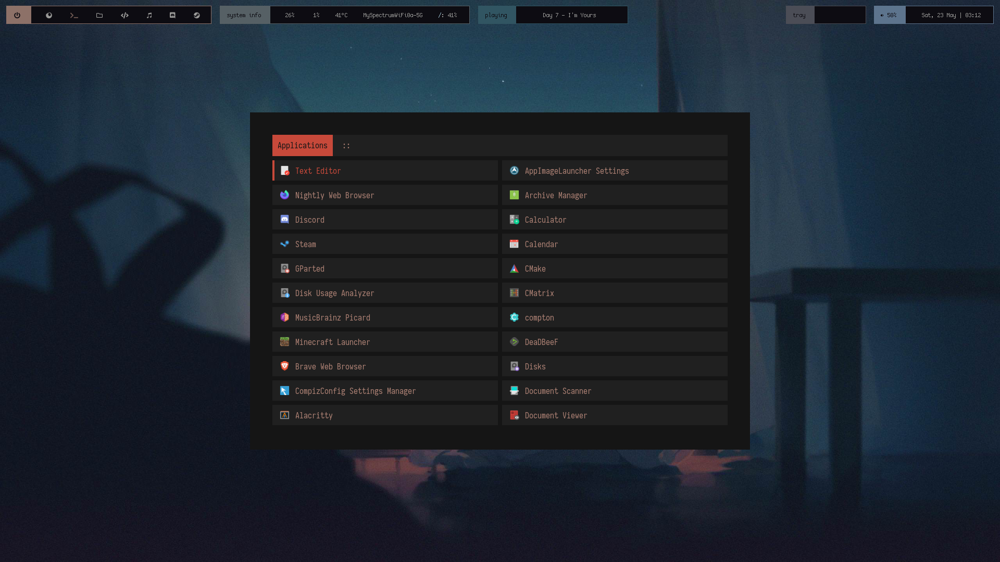
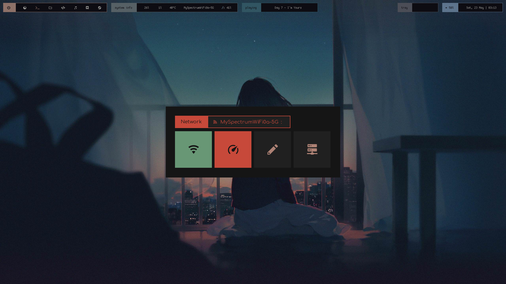
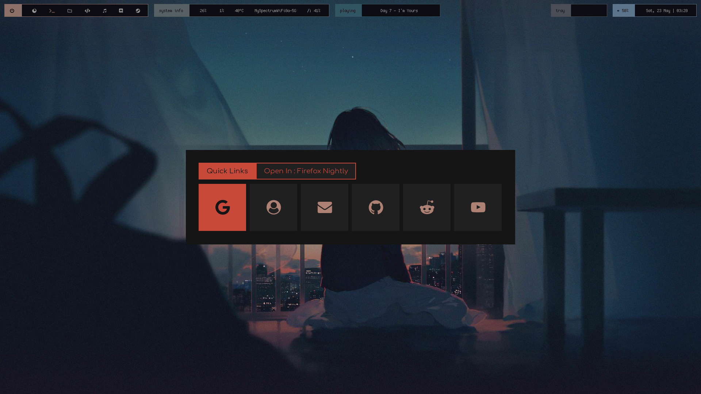
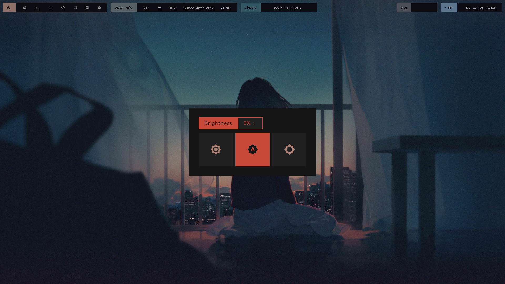
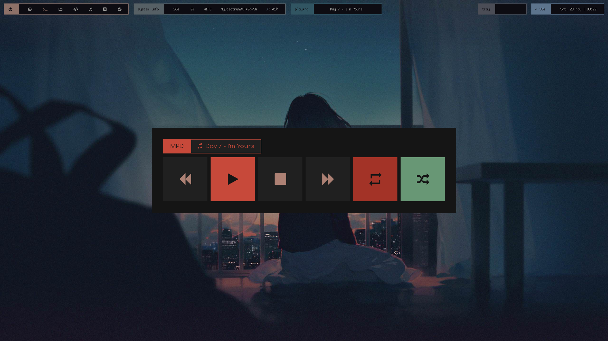
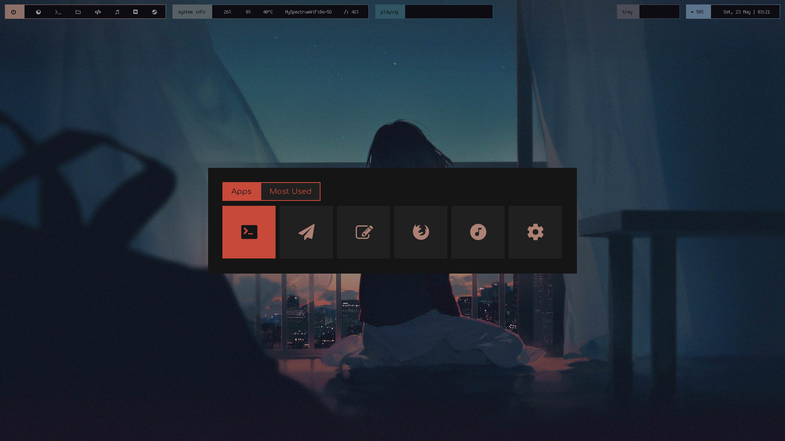

# Overview

My current bspwm setup is as shown:


<details>
<summary>Repo Navigation</summary>

- [Installation](https://github.com/co1ncidence/dotfiles#installation)
- [Polybar Configuration](https://github.com/co1ncidence/dotfiles#polybar-configuration)
- [Rofi Menus](https://github.com/co1ncidence/dotfiles#rofi-menus)
- [Sxhkd Setup](https://github.com/co1ncidence/dotfiles#sxhkd-setup)
- [Custom Firefox Build](https://github.com/co1ncidence/dotfiles#custom-firefox-build)

</details>

## Installation

### Dependencies

#### Fonts required:

+ **CozetteVector** [here](https://awesomeopensource.com/project/slavfox/Cozette)
+ **Font Awesome 5 Free Desktop** [here](https://fontawesome.com/download)
+ **Material Icons** [here](https://github.com/google/material-design-icons/tree/master/iconfont)
+ **Hurmit Nerd Font Mono** [here](https://github.com/ryanoasis/nerd-fonts/tree/master/patched-fonts/Hermit)
+ **Comfortaa** [here](https://www.deviantart.com/aajohan/art/Comfortaa-font-105395949)

#### Programs required (and of course their dependencies as well):

+ **Polybar**: because common sense
+ **Ncmpcpp**: as a music player (cmus is an alternative is mpd is finnicky for you)
+ **Bspwm**: window manager
+ **Cava**: audio visualizer 
+ **Firefox Nightly (latest build)**: if you want to use my custom firefox build
+ **Rofi**: for app launching and various operation menus (for more see [here](https://github.com/co1ncidence/dotfiles#rofi-menus))
+ **All of the dependencies mentioned** [here](https://github.com/adi1090x/rofi#dependencies)


### Installing all configs

first, clone (or download as ZIP) this repository

```bash
git clone https://github.com/co1ncidence/dotfiles.git
```

## Polybar Configuration

## Rofi menus

Here are the rofi menus I use, all credit goes to [adi1090x](https://github.com/adi1090x/rofi) for his amazing work creating these

|Powermenu|Apps|Network|Scrot|
|--|--|--|--|
|||||

|Quicklinks|Brightness|MPD|Frequent Apps|
|--|--|--|--|
|||||

The brightness menu is a bit finnicky since I am using Xrandr to change my brightness (instead of the default xbacklight) and as of yet I dont know a way to display current brightness but the brightness up and down functions do work

## Sxhkd setup

## Custom Firefox Build

**Most credit for this setup goes to [Akshat46](https://github.com/akshat46) and his [Firefox Config](https://github.com/akshat46/FlyingFox)**, anyhoo, I made this Firefox "build" made using the extensions [HNTP](https://addons.mozilla.org/en-US/firefox/addon/humble-new-tab/), [Tree Style Tab](https://addons.mozilla.org/en-US/firefox/addon/tree-style-tab/), and a [Firefox Color](https://addons.mozilla.org/en-US/firefox/addon/firefox-color/) theme


## Installation

### UserChrome.css

My UserChrome.css file can be found in the repo, simply place in the `/chrome` directory in your Firefox profile directory (found by going to about:support)

### Humble New Tab Page Setup

After installing the extension, click the options icon, go to the import/export section, and copy the contents of `firefox/hntp/hntp.css` into the import area, further configuration (i.e. fonts and such) can be done manually through the settings GUI

### Tree Style Tab Setup

After installing the extension, press ctrl + shift + a to go to the extensions management page, select Tree Style Tabs -> Preferences, then scroll down all the way, select "Import" and choose the `firefox/tree-style-tab/treestyletab-config.json` file


