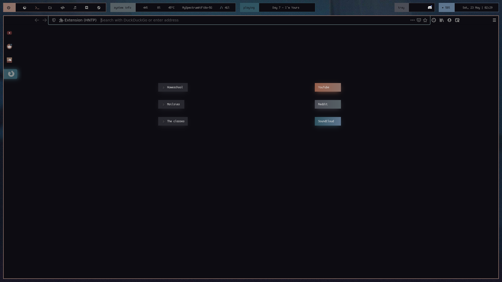

# Overview

My current bspwm setup is as shown:


<details>
<summary>Repo Navigation</summary>

- [Installation](https://github.com/co1ncidence/dotfiles#installation)
- [Polybar Configuration](https://github.com/co1ncidence/dotfiles#polybar-configuration)
- [Rofi Menus](https://github.com/co1ncidence/dotfiles#rofi-menus)
- [Sxhkd Setup](https://github.com/co1ncidence/dotfiles#sxhkd-setup)
- [Custom Firefox Build](https://github.com/co1ncidence/dotfiles#custom-firefox-build)

</details>

## Installation

### Dependencies

Fonts required:

+ **CozetteVector** [here](https://awesomeopensource.com/project/slavfox/Cozette)
+ **Font Awesome 5 Free Desktop** [here](https://fontawesome.com/download)
+ **Material Icons** [here](https://github.com/google/material-design-icons/tree/master/iconfont)
+ **Hurmit Nerd Font Mono** [here](https://github.com/ryanoasis/nerd-fonts/tree/master/patched-fonts/Hermit)
+ **Comfortaa** [here](https://www.deviantart.com/aajohan/art/Comfortaa-font-105395949)

Programs required

+ **Polybar**: because common sense
+ **Ncmpcpp**: as a music player (cmus is an alternative is mpd is finnicky for you)
+ **Bspwm**: window manager
+ **Cava**: audio visualizer 
+ **Firefox nightly (latest build)**: if you want to use my custom firefox build
+ **Rofi**: for app launching and various operation menus (for more see [here](https://github.com/co1ncidence/dotfiles#rofi-menus))


### Installing all configs

first, clone (or download as ZIP) this repository

```bash
git clone https://github.com/co1ncidence/dotfiles.git
```

## Polybar Configuration

## Rofi menus

## Sxhkd setup

## Custom Firefox Build



